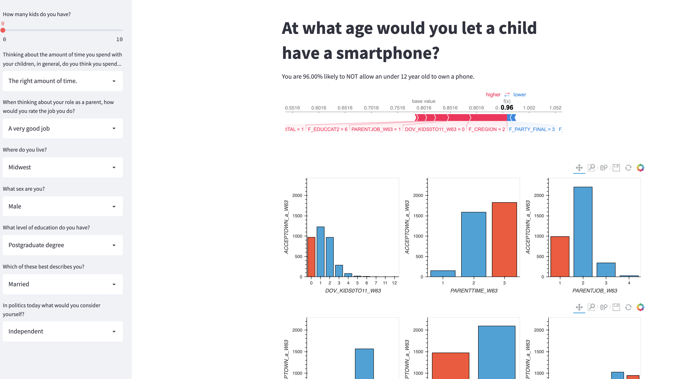

# Stat824Final
A predictive streamlit application based on pew research data. Data and overview available [here](https://www.pewresearch.org/internet/2020/07/28/parenting-children-in-the-age-of-screens/).

## Installation 
Donwload the gitlab repository.

```python 
pip install pipenv
pipenv install
pipenv run streamlit run kidphone2.py
```

## Using the application
Enter the demographic data on the left.

The prediction will update automatically.

All demographic data will then show up to show where the selections fall in all the responses. 

]